### Árvore AA

Uma árvore AA (do inventor, Arne Andersson) é uma árvore de busca binária auto-equilibrada.

A cada nó em uma árvore AA é associado uma valor inteiro, chamado *nível*.
Para que a árvore AA seja válida, é necessário que:
- a árvore seja uma árvore binária de busca válida;
- o nível de todo nó folha (nó sem filhos) seja um;
- o nível de um nó vazio seja 0;
- o nível do filho esquerdo de um nó seja exatamente um a menos que o de seu pai;
- o nível do filho direito de um nó seja igual ou um a menos que o de seu pai;
- o nível do neto direito (filho direito do filho direito) de um nó seja menor que o desse nó;
- todo nó de nível superior a 1 tenha dois filhos não vazios.

A ligação de um nó com seu filho que está no mesmo nível (que só é válida com o filho direito) é chamada de ligação horizontal. As demais são ligações verticais.

Com as restrições acima, tem duas configurações possíveis para um nó intermediário (E é filho de D, mas está no mesmo nível):
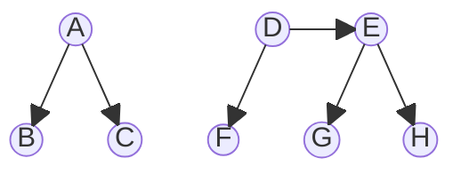

Tendo uma árvore AA, uma operação de inserção ou remoção (que é realizada como em uma árvore binária de busca não equilibrada) pode quebrar alguma dessas regras. Se for esse o caso, é garantido que se consegue retornar a árvore ao estado AA aplicando duas operações sobre cada nó da árvore, no caminho inverso desde o nó inserido ou removido até a raiz. Essas operações são chamadas *skew* e *split*.

A operação *skew* detecta a violação da regra que diz que o nível do filho esquerdo tem que ser inferior ao de seu pai.
A correção é inverter a ligação horizontal, e inverter a relação pai-filho, e mudando a raiz da subárvore para o nó que era filho esquerdo da raiz.
Os filhos desses nós são redistribuídos, tomando o cuidado de manter a ordem exigida pela ABB.
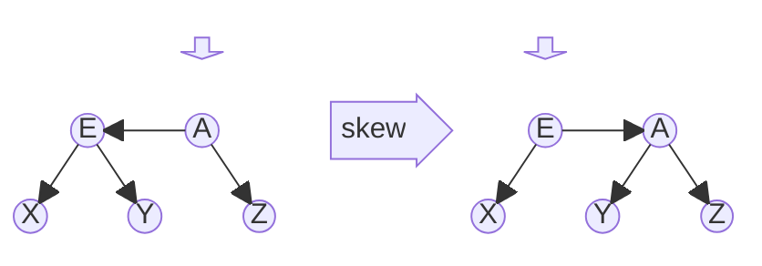
Em código:
```c
//   E <- [A]    ---\     [E] -> A
//  X Y     Z    ---/     X     Y Z
static árvore *skew(árvore *a)
{
  int n = nível(a);
  if (n == 0) return a;  // árvore vazia não tem filho esquerdo
  if (n != nível(a->esq)) return a;
  // filho esquerdo está no mesmo nível — faz a rotação
  árvore *e = a->esq;
  árvore *y = e->dir;
  a->esq = y;
  e->dir = a;
  // retorna a nova raiz
  return e;
}
```
A operação *split* detecta a violação da regra que diz que um nó não pode ter o neto direito no mesmo nível, e coloca o filho direito um nível acima, como raiz dessa subárvore.
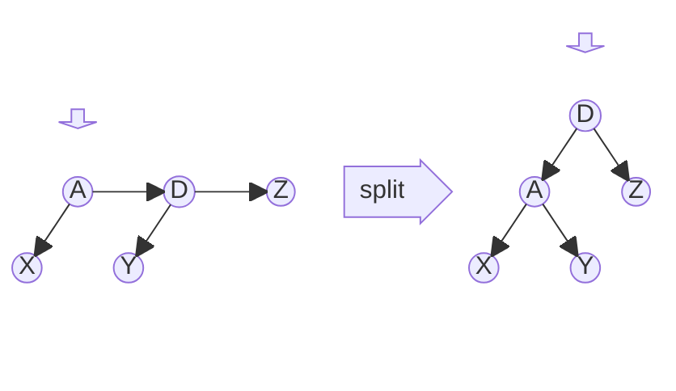
Em código:
```c
//                             [D]
//   [A] -> D -> Z   ---\     A   Z
//   X     Y         ---/    X Y
árvore *split(árvore *a)
{
  int n = nível(a);
  if (n == 0) return a;
  if (n != nível(a->dir)) return a;
  if (n != nível(a->dir->dir)) return a;
  // a + filho direito + neto direito no mesmo nível — rotação
  árvore *d = a->dir;
  árvore *y = d->esq;
  a->dir = y;
  d->esq = a;
  d->nível++;
  return d;
}
```
No caso da inserção, basta chamar essas duas funções antes de retornar da chamada recursiva. Elas testam se a rotação é necessária ou não.
Ou chamar uma função para reequilibrar, no final da inserção:
```c
árvore *equilibra_inserção(árvore *a)
{
  a = skew(a);
  a = split(a);
  return a;
}
```

Já no caso da remoção, antes de chamar essas funções, é necessário verificar se o nó deve ter seu nível reduzido. Isso acontece se o nível do nó tem uma diferença maior que 1 para algum filho. Caso o nível do nó seja reduzido, deve-se verificar se seu filho da direita não ficou em um nível acima e reduzí-lo também se for o caso. Se o nível do nó foi reduzido, para garantir que o nó seja reequilibrado em todas as situações, deve-se chamar *skew* no nó, no filho direito do nó e no neto direito do nó, e então chamar *split* no nó e no seu filho direito.
Em código:
```c
bool diminui_nível(árvore *a)
{
  int n = nível(a);
  if (n == 0) return false;
  int ne = nível(a->esq);
  int nd = nível(a->dir);
  if (n - ne <= 1 && n - nd <= 1) return false;
  a->nível--;
  if (nd > a->nível) a->dir->nível--;
  return true;
}

árvore *equilibra_remoção(árvore *a)
{
  if (!diminui_nível(a)) return a;

  a = skew(a);
  if (!é_vazia(a->dir)) {
    a->dir = skew(a->dir);
    a->dir->dir = skew(a->dir->dir);
  }
  a = split(a);
  a->dir = split(a->dir);
  return a;
}
```
Exemplo de inserção (a raiz é 4, com filhos 2 e 10; 10 tem filhos 8 e 12; 2 tem filhos 1 e 3; 8 tem filhos 5 e 9; 12 tem filhos 11 e 13; 5 tem filho direito 7; 4 e 10 estão no nível 3; 2, 8 e 12 no nível 2; 1, 3, 5, 7, 9, 11 e 13 no nível 1):
```
3     4--->10-----v
2    2    8---v   12
1   1 3  5->7 9 11  13
```
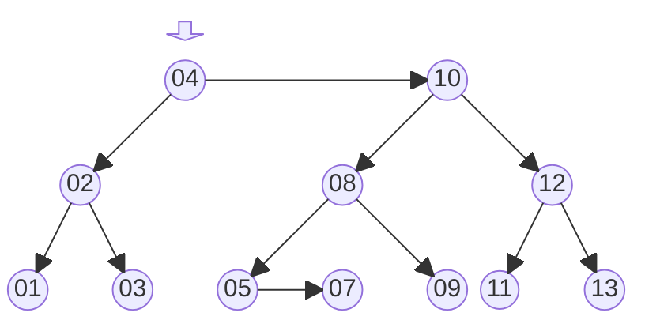
inserção do valor 6 (à esquerda do 7, no nível 1):
```
3     4--->10-----v
2    2    8---v   12
1   1 3  5->7 9 11  13
1          6
```
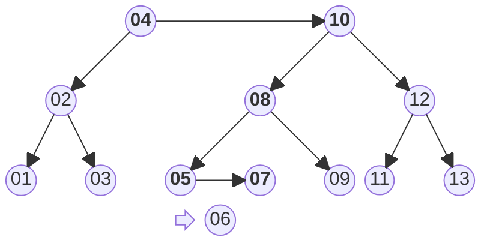
após a inserção, roda skew e split no 6 (não dá nada), sobe para o 7 (o que liga o 6 como filho esquerdo):
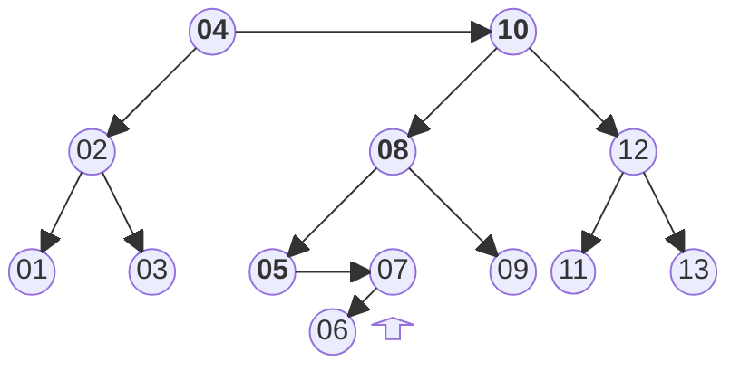
Roda skew no 7 (tem filho esquerdo no mesmo nível -- rotação e raiz local muda para 6):
```
3     4--->10--------v
2    2    8------v   12
1   1 3  5->6->7 9 11  13
```
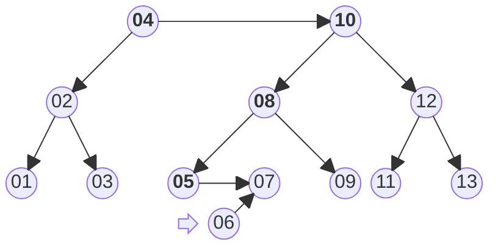
rodando split na raiz local (6) não dá nada. Subindo para o 5, muda o filho direito dele para quem era a raiz local (6):
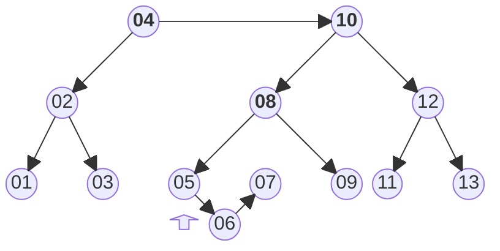
rodando skew no 5 não
  dá nada, mas split sim, porque filho o (6) e o neto dele (7) estão no mesmo nível. O 6 sobe e vira a nova raiz local:
```
3     4------->10----v
2    2    6<--8--v   12
1   1 3  5 7     9 11  13
```
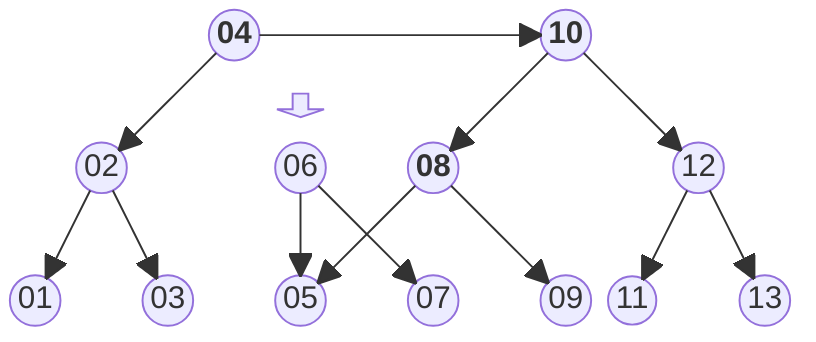
subindo para o 8, o 6 vira novo filho esquerdo do 8:
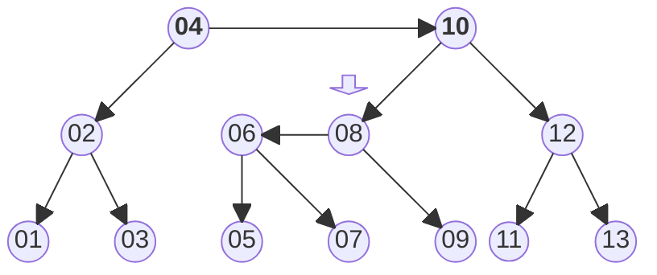
rodando skew na nova raiz local (8), tem filho esquerdo (6) no
  mesmo nível, inverte e a raiz local passa a ser 6:
```
3     4--->10------v
2    2    6-->8    12
1   1 3  5   7 9 11  13
```
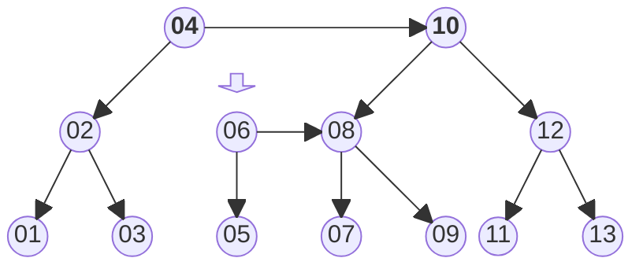
A execução de split no 6 não faz nada. Voltando para o 10, o filho esquerdo dele é atualizado com 6. A execução de skew e split no 10 não faz nada. Subindo para o 4, nem skew nem split, e estamos de volta à raiz da árvore, inserção concluída. O estado final da árvore está abaixo.
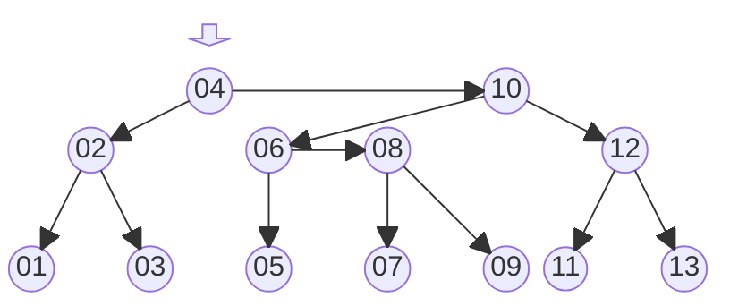


Exemplo de remoção (use um pouco de imaginação, redesenhe a árvore — tem 3 níveis; os filhos do 4 são 2 e 10, os filhos do 10 são 6 e 12, os filhos do 6 são 5 e 8):
```
3      4-->10------v
2     2   6-->8    12
1    1 3 5   7 9 11  13
remove o 1
3      4-->10------v
2     2   6-->8    12
1      3 5   7 9 11  13
o 2 tá no nível 2 e tem o filho esquerdo vazio (nível 0), diminui o nível dele
3    4---->10------v
2         6-->8    12
1   2->3 5   7 9 11  13
o skew e split no 2 e filhos não alteraram nada
o filho esquerdo do 4 (que é o 2) tá dois níveis abaixo, diminui o nível do 4
  (e do 10, que é filho do 4 e ficaria no nível acima)
2    4---->10------v
2         6-->8    12
1   2->3 5   7 9 11  13
o skew do 4 não faz nada, mas do seu filho direito (10) sim, porque tem
  filho esquerdo (6) no mesmo nível
2    4--->6--->10--v
2             8    12
1   2->3 5   7 9 11  13
aí em cima os filhos do 6 são 5 e 10, os do 10 são 8 e 12
ainda falta o skew do neto do 4 (que agora é o 10, e tem filho esquerdo 8
  no mesmo nível)
2    4--->6-->8-->10-->12
1   2->3 5   7   9   11  13
agora o split do 4 (o neto direito dele é o 8, no mesmo nível -- sobe o 6,
  que fica com filhos 4 e 8, e substitui o 4 na raiz; o 4 fica com filhos
  2 e 5)
3     6-------v
2    4---v    8-->10-->12
1   2->3 5   7   9   11  13
mais o split do filho direito de quem substituiu o 4. O filho do 6 é o 8,
  que tem neto 12 no mesmo nível -- sobe o 10, que vira filho do 6; o 10
  fica com filhos 8 e 12, e o 8 fica com filhos 7 e 9:
3     6------>10---v
2    4---v   8     12
1   2->3 5  7 9  11  13
o nó 6 é a raiz e não tem pai, fim da remoção
```
Se alguém fizer desenhos mais bonitos, publico aqui...

