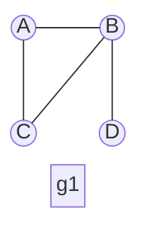
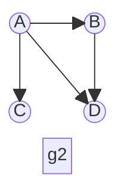

## Grafos

Grafos são usados para representar conexões entre entidades, de forma mais livre que as estruturas anteriores.
Seu campo de aplicação é vasto: podem ser usados para representar a internet (os computadores e as conexões que a compõem), um mapa de estradas (as cidades e as estradas que as ligam), um mapa de relações em uma rede social, as ligações entre páginas da internet, uma rede neuronal em uma implementação de IA, uma rede de atividades e suas dependências em uma obra, etc.
Com uma estrutura de dados que representa uma dessas aplicações, pode-se executar algoritmos para realizar análises sobre essa estrutura, e responder perguntas como:
- Qual o menor caminho entre duas cidades? 
- Qual o caminho mais barato para fazer um percurso entre tais cidades em um passeio de férias?
- Por quantos switches passa um pacote para ir do computador A para o B?
- Por onde passar fibra entre os prédios do câmpus de forma a interligá-los todos pelo menor custo?
- Tal arquivo foi alterado, quais programas devem ser recompilados em função dessa alteração?
- Para instalar este novo programa, quais outros programas e/ou bibliotecas devem ser instalados ou atualizados?
- Se atrasar a concretagem da laje do segundo andar em duas semanas, qual será a consequência no cronograma da obra?

Formalmente, um grafo `G` é definido como dois conjuntos, um conjunto `V` de **vértices** ou **nós** e um conjunto `E` de **arestas** ou **arcos**, que representam conexões entre esses vértices (`G = (V, E)`). O conjunto V não pode ser vazio, o E pode.
("E" vem de *edge*, alguns autores traduzem como "A").

Se as arestas são bi-direcionais (se x conecta a y então y conecta a x), o grafo é dito **não orientado**. Cada aresta é representada por um conjunto contendo 2 nós, escrita com a identificação dos dois nós entre chaves -- uma aresta entre `a` e `b` é escrita assim: `{a,b}` ou assim: `{b,a}`.

Se, ao contrário, as arestas têm direção definida, o grafo é chamado de **orientado**, ou **digrafo** (do inglês digraph -- directed graph). Cada aresta é representada por um par ordenado de vértices, escrito com a identificação dos dois nós entre parênteses -- uma aresta de `a` para `b` é escrita assim: `(a,b)`, e uma de `b` para `a`, `(b,a)`. Nem todo mundo segue essa convenção de escrita, representando arestas como `a-b`, alguns representam pares ordenados como `<a,b>`, alguns não diferenciam na escrita entre ordenados e não ordenados, esclarecendo na descrição do grafo, etc.

O grafo g1 da figura abaixo pode ser representado assim:
```
g1(V,E)
V={A, B, C, D}
E={{A,B},{A,C},{B,C},{D,B}}
```

O grafo g2 pode ser representado assim:
```
g2(V,E)
V={A, B, C, D}
E={(A,B),(A,C),(A,D),(B,D)}
```



Um grafo pode ser **ponderado** ou **valorado**, quando se tem um valor numérico associado a cada vértice ou, mais comumente, a cada aresta. Esse valor pode representar, por exemplo, o custo para se percorrer o caminho representado por essa aresta.

Dois vértices são **adjacentes** ou **vizinhos** se existe uma aresta ligando-os.
Diz-se que essa aresta é **incidente** a esses vértices.
Se o grafo for orientado, o nó de partida da aresta é dito antecessor e o de chegada é o sucessor.

O **grau** de um nó é o número de arestas que incidem sobre ele.
Se o grafo for orientado, divide-se em grau de saída (ou emissão) e grau de entrada (ou recepção).
Um nó é chamado de fonte se o grau de entrada for 0, e de sumidouro se o grau de saída for 0.
Se todos os nós têm o mesmo grau, o grafo é chamado de **regular**. 
Se todos os nós têm arestas com todos os demais, o grafo é chamado de **completo**.

Um **laço** é uma aresta que une um nó a ele mesmo.

Um **caminho** é uma sequência de vértices $(v_0, v_1, v_2, ..., v_n)$, em que $v_0$ a $v_n$ pertencem a $V$, e todos os pares consecutivos no caminho $(v_i,v_{i+1})$ pertencem a $E$ (ou `{`$v_i,v_{i+1}$`}` no caso de grafo não orientado).
Esse caminho une o vértice $v_0$ ao vértice $v_n$ e tem comprimento $n$.
Se não existem vértices repetidos em um caminho, ele é dito **simples**.
Se o primeiro e o último vértice de um caminho são o mesmo, esse caminho é chamado de **ciclo**.

Se existe um caminho ligando $a$ a $b$, diz-se que $b$ é **alcançável** a partir de $a$. 
Se existe um caminho interligando todos os vértices de um grafo, esse grafo é chamado de **conexo**.
No caso de grafo orientado, ele é chamado de **fortemente conexo** se existe pelo menos um caminho que conecta cada dois vértices em cada sentido, os seja, se todos os nós são alcançáveis a partir de qualquer nó.

### Percursos em um grafo

Da mesma forma que em árvores, os percursos mais usuais em grafos são o percurso em profundidade e o percurso em largura.
A implementação deles em grafos é muito semelhante à implementação em árvores.
As principais diferenças advêm do fato que em árvores tem-se um nó principal (a raiz), e num grafo não, e que em um grafo podem existir ciclos, ou mais de um caminho (ou nenhum) para se chegar a um mesmo nó, algo que não é possível em uma árvore.

Essas diferenças podem fazer com que um nó nunca seja visitado, ou seja visitado mais de uma vez.
Para evitar isso, alteramos os algoritmos de percurso de duas formas: uma que considera cada um dos nós como início do percurso, e outra que marca cada nó visitado, para evitar visitar um nó mais de uma vez.
Para isso, ou se coloca uma variável a mais em cada nó, para marcá-lo, ou se usa uma estrutura auxiliar durante o percurso para identificar os nós que já foram visitados.
De qualquer forma, tem um trabalho a mais no início do percurso, para inicializar essas marcas.

#### Percurso em profundidade

```
percurso_profundidade(grafo g):
   // nenhum nó foi visitado ainda
   para cada nó n em g.V
      desmarca(n)
   // inicia o percurso em cada nó que ainda não foi visitado
   para cada nó n em g.V
      if não_marcado(n)
         percorre_profundidade(g, n)

percorre_profundidade(grafo g, vértice n):
   if não_marcado(n)
      visita(n)
      marca(n)
      para cada nó m adjacente a n em g
         percorre_profundidade(g, m)
```

#### Percurso em largura

```
percurso_largura(g):
   fila f
   // nenhum nó foi visitado ainda
   para cada nó n em g.V
      desmarca(n)
   // inicia o percurso em cada nó que ainda não foi visitado
   para cada nó n em g.V
      if não_marcado(n)
         insere(f, n)
      while !vazia(f)
         m = remove(f)
         if não_marcado(m)
            visita(m)
            marca(m)
            // coloca os vizinhos na fila para visita futura
            para cada nó 'o' adjacente a 'm' em 'g'
               if não_marcado(o)
                  insere(f, o)
```

